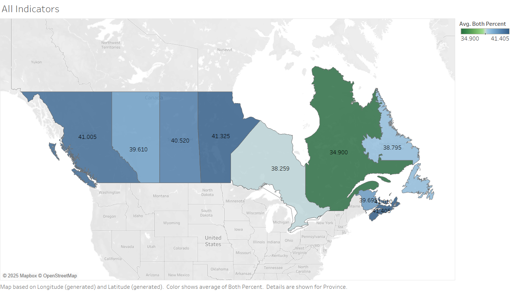
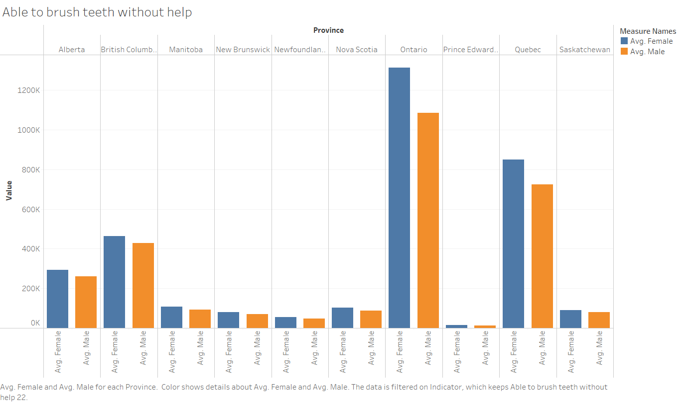
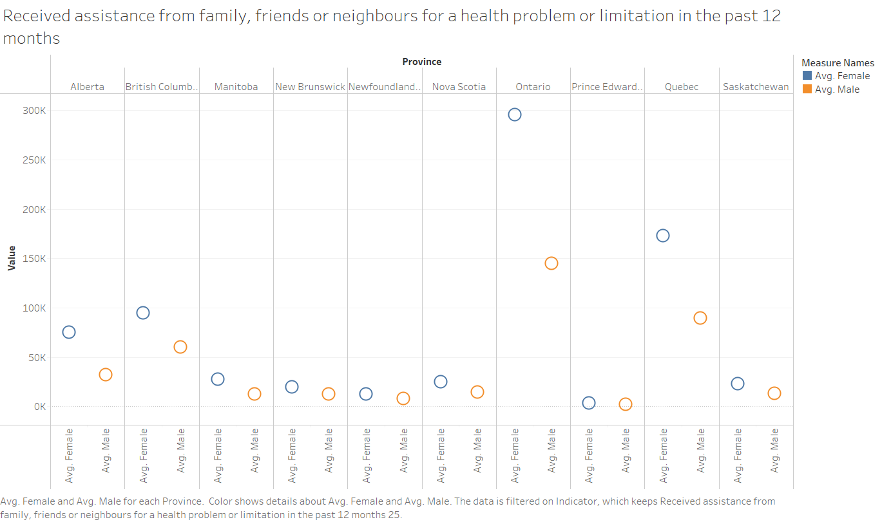
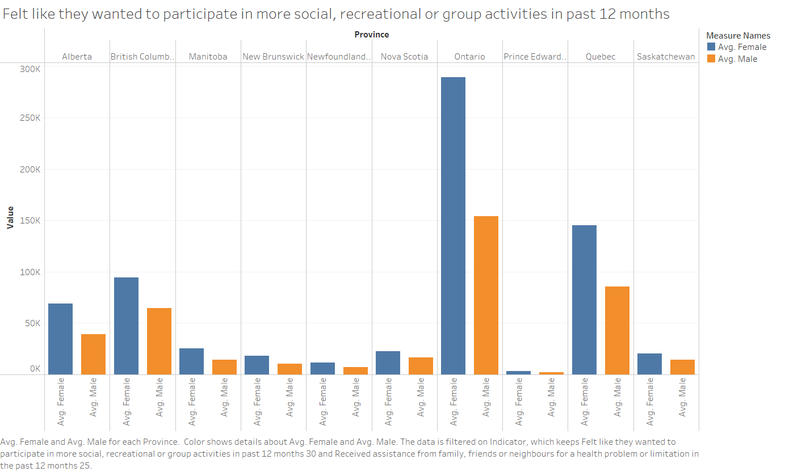
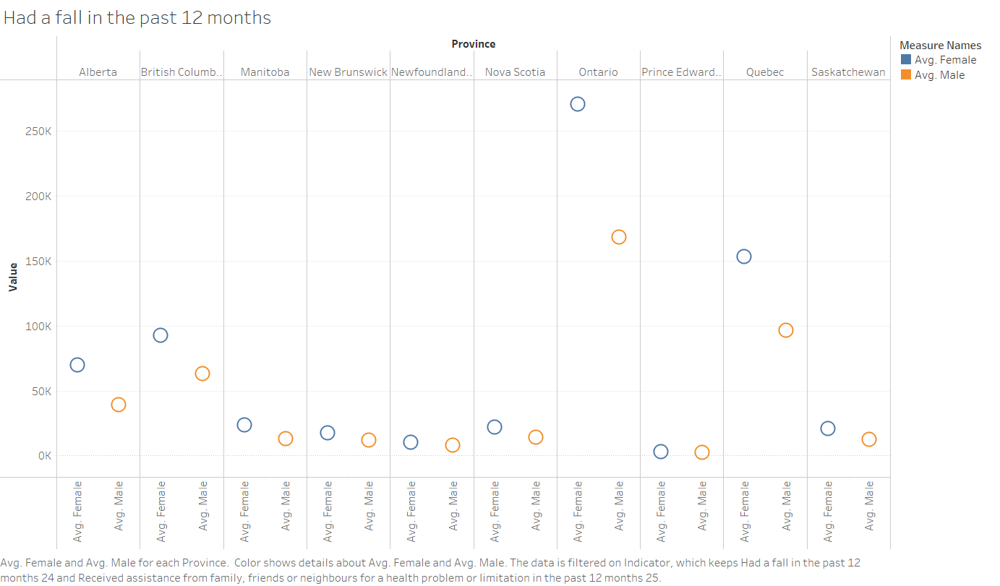
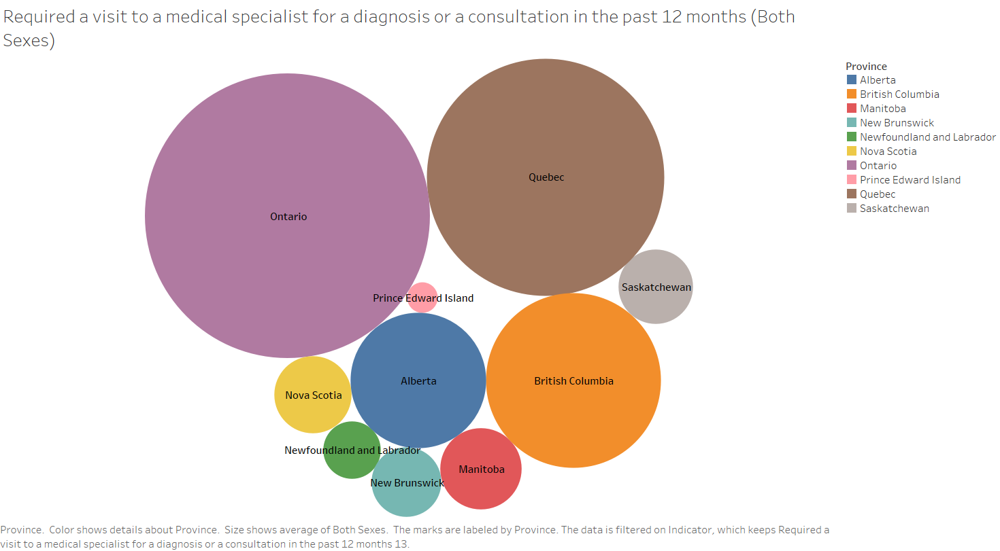
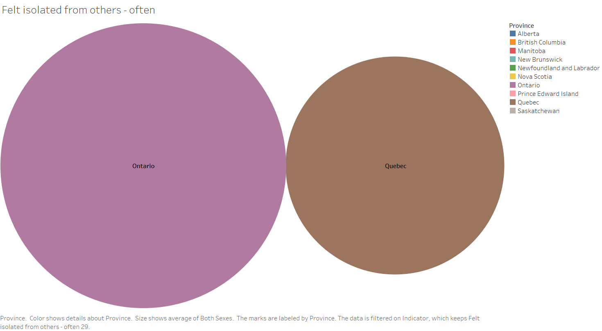
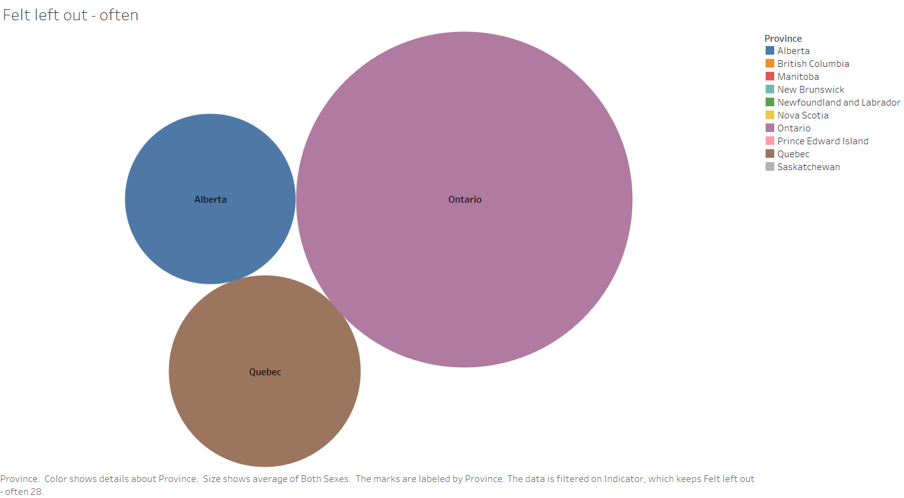
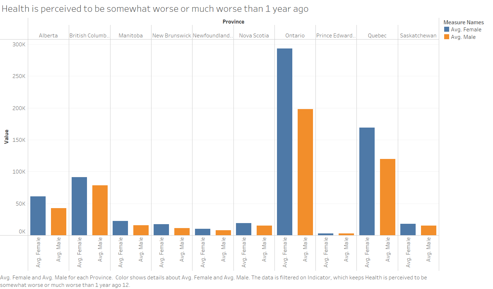
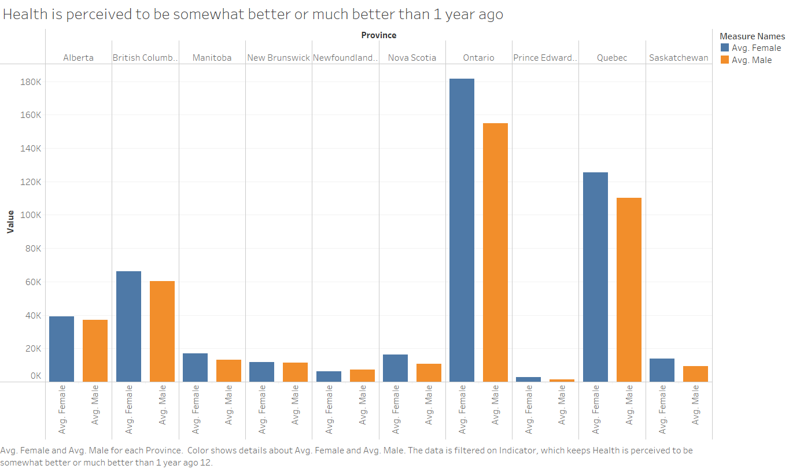

# Evaluating the State of Seniors Healthcare in Canada: Challenges, Innovations, and Policy Recommendations

*By: Francis Ankona Diawuoh*

Executive Summary
Canada’s aging population is growing rapidly, with seniors (65+) projected to make up 25% of the population by 2036. The fastest-growing demographic is those aged 85 and older, with over 62,000 Canadians expected to be 100+ by 2063. However, increased lifespan brings rising healthcare challenges, including a 40% surge in cancer cases by 2030 and a 66% rise in dementia over the next 15 years.

Canada’s healthcare system, originally designed for acute care, struggles to meet seniors’ complex, chronic care needs, with nearly 80% of seniors managing at least one chronic condition. This project examines the state of seniors’ healthcare, identifies key challenges, and explores innovations and policy solutions to ensure accessible, high-quality care for Canada’s aging population

[Read detailed background](Background.md)

## Key Performance Indicators
1.Ability to Perform Oral Hygiene Independently
This indicator assesses seniors' capacity to maintain personal oral hygiene without assistance, reflecting their physical dexterity and cognitive function. While specific statistics on Canadian seniors' ability to perform such tasks independently are limited, understanding this aspect is crucial. It highlights their level of independence and can signal the need for additional support services when declines are observed.

2.Access to Health Support
This metric evaluates the extent to which seniors receive assistance from healthcare professionals or informal caregivers for health-related issues. Data from the National Institute on Ageing indicates that up to 58% of Canadians aged 50 and older have experienced loneliness, which can be exacerbated by limited access to health support. Ensuring adequate support is vital for managing health conditions and maintaining quality of life.

3. Interest in Social Engagement
This indicator measures seniors' desire to participate in social or group activities, reflecting their social well-being. According to Statistics Canada, nearly one in four seniors reported barriers to social participation in 2019 and 2020, with those facing such barriers being almost three times as likely to experience loneliness. Encouraging social engagement is essential for mental and emotional health.

4.Fall Incidents
This metric tracks the prevalence of falls among seniors, a significant health concern due to the risk of serious injury. While specific statistics on fall incidents were not found in the provided sources, monitoring this indicator is crucial for implementing preventive measures and ensuring seniors' safety.
5.Healthcare Utilization
This indicator reflects the frequency of seniors' interactions with healthcare services. According to the National Institute on Ageing, as many as 41% of Canadians aged 50 and older are at risk of social isolation, which can lead to increased healthcare needs. Regular healthcare utilization is important for early detection and management of health issues.

6.Feelings of Isolation
This metric assesses the prevalence of loneliness among seniors. A study by Statistics Canada revealed that almost one in five Canadian seniors (19%) aged 65 and older reported experiencing loneliness in 2019 and 2020, with senior women more likely to report being lonely than senior men (23% versus 15%). Addressing feelings of isolation is crucial for seniors' mental and physical health.

7.Perceived Health Decline
This indicator captures seniors' subjective assessment of their health over time. While specific statistics on perceived health decline were not found in the provided sources, understanding this perception is important for identifying areas where healthcare interventions may be needed to improve seniors' well-being.

<mark>consider adding details, e.g.</mark>
**Technical Details:**

    - $Rate = {Count Of Admissions \over SeniorPopulation}$ 
    - Dimensions: By province
    - Frequency: Yearly?

# Analysis

Some text or whatever

.
Explanation of figure above
.
.
.
.
.
.
.
.

